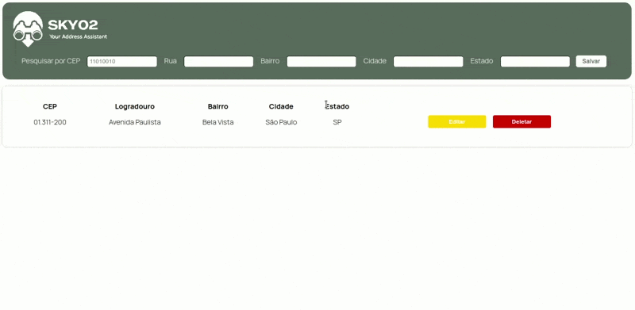

# SKY02 - Your Address Assistant

## 🖥 Sobre o projeto

O projeto é um app para visualização, inserção, atualização e exclusão de endereços cadastrados em um servidor backend.

## 🚀 Executando a aplicação

O projeto é dividido em duas parte:

1. [API para inserção e visualização dos dados.](https://github.com/matheuscarvalhoscm/sky02-api)
2. Interface (disponível nesse repositório).

💡️ A interface precisa que o servidor (API) esteja sendo executado para renderizar os dados corretamente.

### **🎲️ Rodando a interface**

~~~
# clone o repositório
git clone https://github.com/matheuscarvalhoscm/sky02-ui.git

# acesse a pasta do app
cd sky02-ui

# instale as dependências
npm install

# execute a aplicação
npm run serve

# A aplicação inciará na porta:8080 - acesse http://localhost:8080
~~~
---
## 🛠️ Tecnologias
As seguintes tecnologias foram utilizadas na construção desse projeto:

---

## 📧 Contato

---

## 📚 Referências
- [Vue Docs](https://vuejs.org/guide/introduction.html)
- [Stack Overflow](https://stackoverflow.com/)